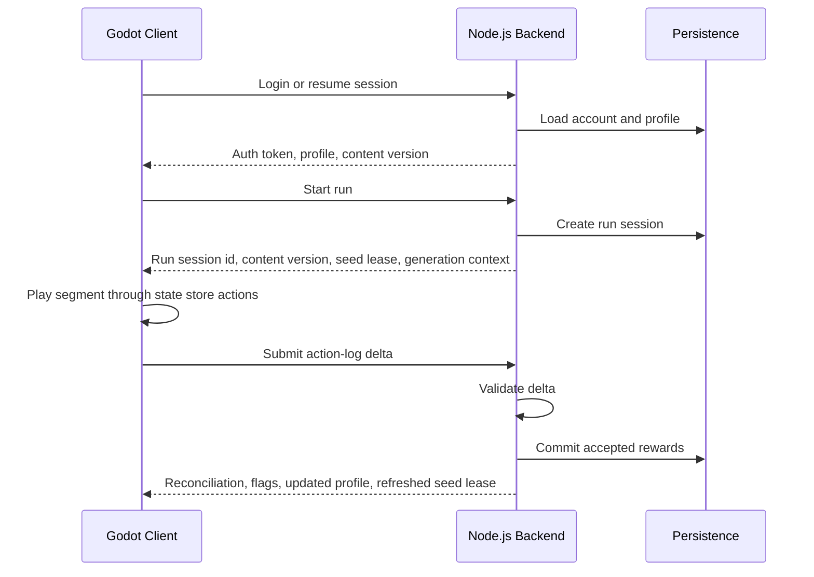

# Technical Architecture

## Planned Project Layout

```text
Vaporwave Vikings Idle/
  docs/
  godot-client/
  backend-service/
```

The repository starts documentation-first. The Godot client and Node.js backend service can be added once the initial design and technical boundaries are clear.

## High-Level Flow



## Trust Boundaries

Normal active play requires internet with routine server checkpoints every two minutes to keep operating costs low. A proposed 1-2-minute retry allowance after a checkpoint is due gives an absolute limit of 3-4 minutes of provisional progress since the last accepted state. The recommended two-minute retry allowance remains unconfirmed. Closed-app progression initially grants gold only. These are separate systems: the retry allowance supports intermittent connectivity, while away income compensates time not actively playing. Exact retry timing and away-income rates remain open.

The client can present predicted rewards quickly, but the backend owns durable progression. Any profile-changing action should be accepted by the server before it becomes final.

Server-owned state should include:

- Account identity.
- Player profile.
- Gold and resource balances.
- Upgrade levels.
- Gear inventory and equipped gear.
- Run sessions and accepted run reports.
- Server-issued map seeds and generation algorithm versions.
- Seed leases, profile versions, and accepted deltas.
- Economy ledger entries.
- Content and balance version used for validation.

Client-owned or client-predicted state can include:

- Local visual effects.
- In-progress run animation.
- Temporary reward previews.
- Predicted state store and pending action log.
- Cached profile data.
- User settings.

## Backend Responsibilities

- Authenticate players.
- Store profiles.
- Issue run sessions.
- Validate action-log deltas and progress reports.
- Commit rewards.
- Process purchases and upgrades.
- Serve content and economy configuration.
- Issue deterministic map seeds for run sessions.
- Issue and refresh seed leases.
- Reconstruct generated tile ranges for validation.
- Produce telemetry for balancing and cheat detection.

## Client Responsibilities

- Run the side-scrolling gameplay.
- Dispatch gameplay actions through the client state store.
- Generate route tiles from server-issued map seeds.
- Present upgrades, gear, and progression.
- Cache enough data for smooth mobile play.
- Submit action-log deltas on handshake/report intervals.
- Handle network failures gracefully.
- Reconcile predicted rewards with server-accepted rewards.

## Initial Technology Direction

- Game client: Godot.
- Backend service: Node.js.
- Database: to be decided.
- Hosting: to be decided.
- Analytics and crash reporting: to be decided.
- Auth provider: to be decided.

## Key Architectural Questions

- Should backend code be plain JavaScript or TypeScript?
- Which Node.js web framework should be used?
- What persistence layer should own player state?
- Should content configuration be stored in database rows, versioned JSON, Godot resources, or a shared content package?
- Which shared deterministic RNG should be used by Godot and Node.js?
- What retry allowance and waiting-state behavior best support intermittent reception at the confirmed two-minute checkpoint cadence?
