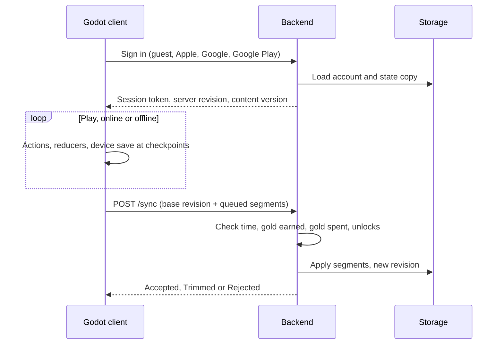

# Architecture

A Godot mobile client that plays from its own save, and a small Node.js backend that keeps a validated copy. The player state model is in the [state store spec](state-store-spec.md).

## Layout

```text
Vaporwave Vikings Idle/
  docs/                     design and technical docs (this folder is the source of truth)
  vaporwave-vikings-idle/   Godot 4.6 project, mobile renderer (empty so far)
  backend-service/          Node.js + Express + TypeScript REST service
```

## How the parts talk



## Trust boundary

- The device save is the working copy. The game never waits on the network to play.
- The server owns the validated copy: the latest accepted state, its revision, and the server time of the last sync.
- The server judges plausibility, not every frame: could this much gold have been earned in this much time? See the server checks in the [state store spec](state-store-spec.md).
- Away gold is always measured on the server's clock.
- Ascension and talent purchases need a successful sync first (proposed, T3).

## Client (Godot)

| System | Responsibility |
| --- | --- |
| `Store` autoload | Owns state, `dispatch`, selectors, `changed` signal, segment builder |
| Runner | Moves the Viking, auto-jump at pit edges, tap jump, sprint |
| Level builder | Assembles surface levels from tiles (see [Level generation](../game-design/level-generation.md)) |
| Combat | Sword, equipped ranged weapon and wand, crit rolls, elites, bosses, death |
| Spawner | Places enemies from `enemy_pool(biome)`, including active dimensions |
| Effects | Colour shifts, dimension set pieces, particles, sound; reacts to actions |
| Courses | Hand-made sky and cave levels, one-fall failure, ad retry |
| Shop and menus | Gear rows, artefacts, unlocks, ascension and talents, Village |
| Save | Writes `user://save.json` at checkpoints and on background |
| Sync | Sends queued segments, applies Accepted / Trimmed / Rejected |

Mobile notes: save whenever the app leaves the screen; keep combat readable under the colour shifts; keep progression maths independent of frame rate.

## Backend

Express, TypeScript and Vitest, with in-memory storage for now. See `backend-service/README.md` for running it.

| Method | Path | Status |
| --- | --- | --- |
| `GET` | `/health` | Built |
| `GET` | `/api/v1/config` | Built (content and economy config) |
| `POST` | `/api/v1/auth/guest` | Built |
| `POST` | `/api/v1/auth/apple`, `/google`, `/google-play` | Built (needs platform credentials) |
| `GET` | `/api/v1/profile` | Built |
| `POST` | `/api/v1/run/start`, `/api/v1/run/report` | Built; to be replaced by `/sync` |
| `POST` | `/api/v1/upgrade/purchase` | Built; purchases move into sync segments |
| `POST` | `/api/v1/sync` | To build: checks and applies segments |
| `POST` | `/api/v1/away/claim` | To build: server-clock away gold |

Platform sign-in details are in [Platform authentication](platform-authentication.md).

Every gold change should leave a ledger entry so the economy can be audited later.

## Shared content

Gear costs and stats, enemy gold, spawn rates, brackets and away rates live in content tables that both the client and the server read. Proposed: versioned JSON in the repo, imported by Godot and by the backend, with the content version stored in each save.

## Open

- Database and hosting (none chosen; in-memory today).
- Analytics, crash reporting and the ad provider.
- Where tile and content data live (proposed shared JSON).
