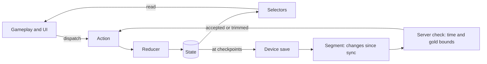

# Player state store spec

One store on the device holds everything about the player. Gameplay never changes gold, gear or unlocks directly: it dispatches an action, a reducer produces the next state, and the UI reads the result through selectors.

The store saves to the device at every checkpoint and whenever the app goes to the background. It sends the server only the difference since the last accepted sync. The server checks that the gold in that difference was possible in the time played, then accepts it or trims it.

Decided 7 October 2026: Redux-style store, offline play validated later, difference-only sync with a gold bound. Everything else here is a proposal unless [decisions](../decisions.md) says otherwise.

## How it works



Every change to the player follows the same loop: something happens, an action describes it, a reducer returns the next state, and everything that cares is told.

- **Only reducers change state.** Scenes, UI and network code dispatch actions and never write to the state themselves.
- **An action says what happened, not what to change.** `ENEMY_KILLED`, not `ADD_GOLD`. The reward maths lives in one place, the reducer.
- **Reducers are pure.** Same state plus same action always gives the same result. No clock, no random numbers, no network, no sound.
- **Time and luck arrive on the action.** The scene rolls the crit and passes `crit: true`. A `TIME_ADVANCED` action carries seconds played, so timers run on play time and pause when the game does.
- **Selectors are the read path.** UI and gameplay ask a selector for gold per metre or next cost. Nobody recomputes those by hand.
- **Effects listen, they don't own.** Sound, particles, saving and networking react to actions. If they need to change something they dispatch another action.
- **State is plain data.** Dictionaries, arrays, numbers and strings only, so the whole tree turns into JSON as it stands.

In Godot 4.6 this is one autoload, `Store`, with `dispatch(action)`, `select(name, args)` and a `changed(slice)` signal. Reducers, selectors and the segment builder are plain scripts with no scene dependencies, so they can be tested without running the game.

Gold is a 64-bit float: exact to about 15 digits and good to 10^308, well past the 10^46 the gear ladder draft implies. Affordability checks compare full values, never the rounded label.

## State tree

One tree, fourteen slices. Each slice has one reducer and a fixed answer to "what happens on ascension".

| Slice | Holds | On ascension |
| --- | --- | --- |
| `meta` | Save format version, player id, device id, content version | Kept |
| `wallet` | `gold` now, `lifetime_gold` ever earned | `gold` resets, `lifetime_gold` kept |
| `gear` | Per slot (22 rows): `unlocked`, `level` | Resets |
| `artefacts` | Per artefact: `owned`, `level`, `upgraded` | Resets unless a talent keeps them |
| `loadout` | Equipped wand, equipped ranged weapon | Resets with artefacts |
| `unlocks` | Ingredients discovered, pickups unlocked, courses completed | Resets unless a talent makes that kind permanent |
| `inventory` | Ingredients in the bag (raw and mixed), materials such as pelts and demon hide | Open (T8) |
| `effects` | Active dimension effects and timed pickups, each with its form and when it ends | Cleared |
| `run` | World+ level, biome, level in the biome, distance, health, sprint cooldown, seconds played | Resets |
| `progress` | Biomes beaten in this world (the badges), bosses beaten | Resets |
| `stats` | Counters: kills by enemy role, coins, metres, deaths, times each plant was eaten | Lifetime counters kept, run counters reset |
| `ascension` | `level` (equals points earned), `points_unspent`, talents and their ranks | Kept |
| `village` | Buildings, garden plots, seeds, villagers, seed achievements | Open (V4) |
| `sync` | Last accepted server revision, the baseline it was built on, queued segments, last sync time | Kept |

`settings` (sound, auto-consume rules) sits beside the tree and never resets.

**Ascension is one rule, not fourteen.** Nothing survives unless a talent makes it permanent. So the `ASCENDED` reducer starts from a fresh initial state, copies across the slices marked Kept, then copies only what the owned talents name. A new "keep this" talent is a data change, not new code.

**Not in the store:** positions, animations, enemies on screen, particles. Those belong to the scene and are rebuilt from `run` when the game loads.

```json
"gear": {
  "sword":  { "unlocked": true,  "level": 42 },
  "chest":  { "unlocked": true,  "level": 17 },
  "legs":   { "unlocked": true,  "level": 3 },
  "gloves": { "unlocked": false, "level": 0 }
}
```

What a level is worth (damage, defence, gold boost, cost) is not in the save. It lives in content tables that both the game and the server read, so balance can change without touching anyone's save.

## Actions

| Group | Action | Payload | Reducer does |
| --- | --- | --- | --- |
| Run | `TIME_ADVANCED` | seconds | Adds play time, expires timed effects and pickups, ticks sprint cooldown |
| Run | `DISTANCE_TRAVELLED` | metres | Pays gold per metre, adds to distance |
| Run | `COIN_COLLECTED` | coin kind, count, from sky | Pays coin gold |
| Run | `ENEMY_KILLED` | enemy id, role, dimension, crit | Pays enemy gold with crit and source boosts, counts the kill, may add a material |
| Run | `PLAYER_DAMAGED` | amount | Lowers health |
| Run | `PLAYER_DIED` | cause | Counts the death, restores health, restarts the level |
| Run | `PIT_FALLEN` | none | Moves the Viking further along; no death |
| Run | `SPRINT_USED` | none | Starts the sprint and its cooldown |
| Run | `BOSS_DEFEATED` | boss id | Pays the boss, marks the biome beaten, advances the level |
| Run | `WORLD_ADVANCED` | none | Raises the World+ level, clears this world's badges |
| Run | `PORTAL_TAKEN` | biome id | Switches biome without paying for skipped distance |
| Shop | `GEAR_LEVEL_BOUGHT` | slot, count | Spends gold, raises the level |
| Shop | `ARTEFACT_LEVEL_BOUGHT` | artefact id, count | Spends the cost, raises the level |
| Shop | `ARTEFACT_UPGRADED` | artefact id | Spends materials, sets `upgraded` |
| Shop | `WEAPON_EQUIPPED` | family, artefact id | Sets the wand or ranged weapon in use |
| Discovery | `COURSE_ENTERED` | course id | Remembers where to return to |
| Discovery | `COURSE_FAILED` | course id | Returns to the surface |
| Discovery | `COURSE_COMPLETED` | course id, reward | Marks it complete and grants the artefact, ingredient or pickup unlock |
| Effects | `INGREDIENT_EATEN` | ingredient id, form, source | Starts the dimension effect, counts the eat, uses stock if from the bag |
| Effects | `PICKUP_COLLECTED` | pickup id | Starts the timed pickup |
| Effects | `MATERIAL_GAINED` | material id, count | Adds to inventory |
| Village | `BUILDING_UNLOCKED` | building id | Adds the building |
| Village | `SEED_PLANTED` | plot, ingredient id | Uses a seed, starts growth |
| Village | `CROP_HARVESTED` | plot | Adds ingredients and seeds to inventory |
| Village | `INGREDIENT_MIXED` | ingredient id | Turns a raw ingredient into the whole-level form |
| Ascension | `ASCENDED` | none | Banks points, rebuilds state from the keep rules |
| Ascension | `TALENT_BOUGHT` | talent id | Spends points, raises the talent's rank |
| Away | `AWAY_GOLD_CLAIMED` | seconds away, gold | Pays the reduced away rate |
| System | `STATE_LOADED` | saved state | Replaces state after migrating it to the current save format |
| System | `CHECKPOINT_REACHED` | reason | Closes the current sync segment and queues it |
| System | `SYNC_ACCEPTED` | server revision | Drops the accepted segments, moves the baseline forward |
| System | `SYNC_TRIMMED` | server revision, gold removed | Same, and takes the trimmed gold out of the wallet |
| System | `SYNC_REJECTED` | server state | Replaces state with the server's copy |

Three things have no action of their own because they follow from other state:

- **Gear slot unlocks.** After any action that adds gold, the wallet reducer checks the next bracket and sets `unlocked`. Once set it stays set (G6).
- **Seed achievements.** `INGREDIENT_EATEN` raises the count; when it reaches the target and the garden is owned, the seed is granted.
- **Effects ending.** `TIME_ADVANCED` and level changes end effects; nothing has to remember to send an "expired" action.

Wand casts and ranged shots are not actions. They matter to the store only through the kills they cause.

## Selectors

| Selector | Returns | Used by |
| --- | --- | --- |
| `gold_per_metre` | Gold for one metre, after boots, socks and all-gold boosts | Distance reward, HUD |
| `coin_value(kind)` | Gold for one coin of that kind | Coin reward |
| `enemy_gold(enemy, crit)` | Gold for a kill, with role, dimension and crit boosts | Kill reward |
| `damage`, `ranged_damage`, `magic_damage` | Damage per hit for sword, equipped ranged weapon, equipped wand | Combat |
| `crit_chance`, `crit_damage`, `crit_gold` | The three crit stats | Combat, kill reward |
| `defence`, `max_health` | Survival stats from Chest and the health piece | Combat |
| `has_sprint`, `sprint_speed_bonus` | Whether Legs are owned, and the Socks bonus | Sprint button, movement |
| `next_level_cost(slot)` | Gold for the next level of a gear piece | Shop row |
| `can_afford(slot)` | True when gold covers that cost | Shop button colour |
| `next_slot_unlock` | The next locked slot and its gold bracket | Shop, HUD hint |
| `active_effects` | Dimension effects and pickups now running, with time left | HUD, spawner |
| `enemy_pool(biome)` | Real-world enemies plus those revealed by active effects | Spawner |
| `expected_gold_per_second` | Average earning rate for the current state | Away gold, the sync bound |
| `pending_ascension_points` | Points that ascending now would bank | Ascension screen |
| `biome_badges` | Biomes beaten in the current world | HUD |

`expected_gold_per_second` is the gold model from [Economy](../game-design/economy.md) evaluated for the current state. The server computes the same number from the same content tables, which is how it knows what was possible.

## Saving and sync

The device save is the working copy and the game always runs from it, with or without a connection. The server holds a validated backup and only ever receives differences.

### Saving to the device

The whole state is written as JSON to `user://save.json` at every checkpoint, whenever the app goes to the background, and when it closes. Each write goes to a temporary file that then replaces the save, and the previous save is kept as a backup, so a crash mid-write cannot corrupt it.

Close cannot be the only save. Phones stop background apps without warning, so the save taken when the app leaves the screen is the one that counts.

### Checkpoints

A checkpoint saves and closes off a sync segment. These trigger one:

- A boss fight ends, win or lose
- The level or biome changes, including portals and World+
- An assault course ends
- A burst of purchases finishes (a few seconds after the last tap)
- An ascension or a talent purchase
- 60 seconds of play since the last checkpoint
- The app goes to the background or closes

### What gets sent

Between two checkpoints the store builds a **segment**: the difference, not the state. Reducers add to running totals as they pay gold, and the builder compares gear, artefacts, unlocks and progress with how they stood when the segment opened.

```json
{
  "seq": 118,
  "play_seconds": 60,
  "away_seconds": 0,
  "gold_earned": { "distance": 3100, "coins": 9400, "basic": 7600,
                   "elite": 4500, "boss": 0, "dimensional": 4800 },
  "gold_spent": 21000,
  "counts": { "metres": 310, "coins": 152, "kills_basic": 31,
              "kills_elite": 3, "deaths": 1 },
  "changes": { "gear": { "sword": [42, 45] },
               "progress": { "level": [3, 4] } }
}
```

A segment is a few hundred bytes. A sync request carries the server revision it builds on plus every queued segment in order.

### When it sends

- **Online:** at a checkpoint, but no more than once every two minutes, to keep server cost low. Also on launch and, as a best effort, when the app goes to the background.
- **Offline:** segments queue on the device and play carries on. They are sent in order when a connection returns.
- **Long offline spells:** old queued segments are merged into one-hour blocks so the queue stays small.

| Answer | Meaning | Store does |
| --- | --- | --- |
| Accepted | Everything was within bounds | Drops the sent segments and records the new revision |
| Trimmed | Gold earned was above what was possible | Same, and removes the excess gold from the wallet, never below zero |
| Rejected | The request cannot be valid (wrong order, impossible purchase) | Replaces the device state with the server copy |

### Time away

On launch the game first sends anything queued, then asks the server for away gold. The server measures the gap with its own clock and applies the away rates in [Economy](../game-design/economy.md). If the game launches offline, it estimates from the device clock and records the claim in a segment, which the server checks later.

### Two devices

The server keeps one revision number per player. A request built on an older revision means another device has synced since. Proposed: ask the player which save to keep (T4).

## Server checks

The server asks one question of each segment: could this much gold have been earned in this much time by this player? Five checks, in order:

1. **Revision and order.** The request builds on the server's current revision, and segment numbers continue from the last accepted one.
2. **Time.** Play seconds plus away seconds across all segments cannot exceed the real time since the last accepted sync, by the server's clock. This covers changed device clocks and speed hacks.
3. **Gold earned.** Each segment's gold must be at or under the allowed amount below.
4. **Gold spent.** Gold spent must equal the content-table cost of the level changes reported, and the wallet can never go below zero.
5. **Unlocks and progress.** A gear slot can only unlock if the wallet could have reached its bracket. A boss or course result must belong to the level the player was on. Ascension points must match lifetime gold.

```latex
\text{allowed gold} = \text{rate} \times \text{play seconds} \times \text{margin} + \text{away rate} \times \text{away seconds} + \text{boss and course rewards reported}
```

`rate` is `expected_gold_per_second` for the server's copy of the player with the segment's changes applied, so purchases made mid-segment get the benefit of the doubt. `margin` covers what the average leaves out: pickups, crit luck, sky coins, sprint and farm courses. Proposed start: 2 (T6).

A segment that fails check 3 has its gold cut to the allowed amount (Trimmed). One that fails 1, 2, 4 or 5 is Rejected.

**What the server stores per player:** the state copy, its revision number, the server time of the last sync, and a short log of recent segments and trims.

**What this does not do.** It caps totals; it cannot tell a player earning at the maximum rate from a script doing the same. That is acceptable while there are no leaderboards or purchases to protect.

### Later hardening

The June design had a stricter model, left out for now. If it is ever needed, these are the pieces, and the `counts` in each segment are kept so they can be added without changing the game:

- Rebuild each level from its seed on the server and check coins and kills against what was actually placed.
- Mark mutually exclusive rewards (high route vs low route) in tile data.
- Per-segment efficiency caps (for example 90 percent of the theoretical maximum on dense tiles).
- A trust score that tightens limits for accounts that keep hitting the cap, up to restricting offline play or banning.
- Verified rewarded-ad completion through the ad provider, with each ad reward granted once.

## Backend changes

`backend-service/` already has guest and platform sign-in, profile storage and a run report with an upper-bound gold check. Sign-in and profile stay. `run/start` and `run/report` are replaced by a single `POST /api/v1/sync`, and the bounds move from `gameConfig.ts` into content tables shared with the game. See [Architecture](architecture.md).

## First build

| Part | In the first build | Later |
| --- | --- | --- |
| Slices | `meta`, `wallet`, `gear`, `run`, `progress`, `effects`, `unlocks`, `stats`, `sync` | `artefacts`, `loadout`, `inventory`, `ascension`, `village` |
| Gear | The ten warrior pieces, Sword to Cloak | Under-layers, jewellery, set pieces |
| Run actions | Time, distance, coins, kills, damage, death, pit fall, sprint, boss defeated | World+ and portals |
| Discovery | One assault course, one ingredient unlock | Artefacts, pickups, farm courses |
| Effects | One dimension ingredient eaten from surface boxes | Mixed form, auto-consume, timed pickups |
| Saving | Device save at checkpoints and on background | Save migration between versions |
| Sync | Segment builder, queue, `POST /sync` with checks 1 to 4 | Check 5, away gold, two-device choice |

Empty slices for the later parts exist from day one so adding them does not change the save format. Build order is in [First build](../production/first-build.md).

## Open

T3 ascending offline, T4 two devices, T5 trimming spent gold, T6 margin, T7 offline cap, T8 inventory and Village on ascension, G1 level cost curve, G6 slot unlock memory, D1 and D2 effect timers. All are in [decisions](../decisions.md).
